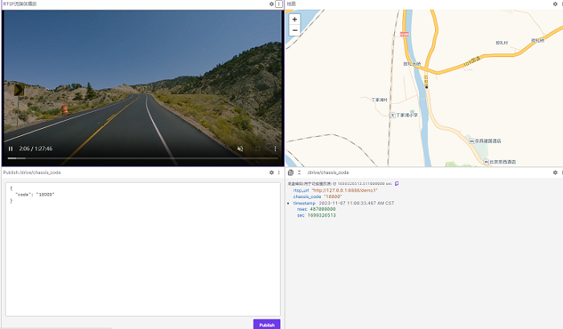
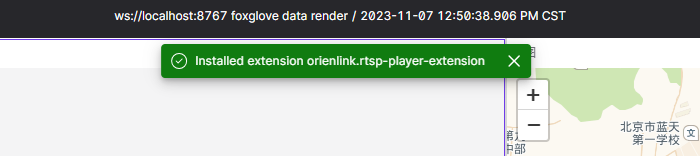
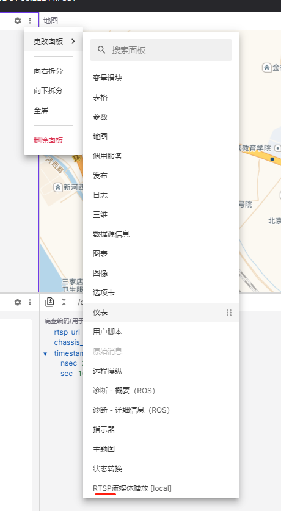

# rtsp-player-extension

## usage

Using `iframe` to embedded a `RTSP` stream and play it seamlessly.

code:

```html
<iframe allow="autoplay" src="http://127.0.0.1:8888/demo1" style="overflow: hidden; height: 100%; width: 100%;"></iframe>
```

effect:

 

## get started

1. `https://github.com/foxglove-custom/rtsp-player-extension.git`

2. `cd rtsp-player-extension.git`

3. `npm install`

4. `npm run package`,it will generate a `foxe` file called `orienlink.rtsp-player-extension-0.0.1.foxe`

5. Drag it into your `foxglove` web page,if it install success,we will see the notify message like below:

   

6. Custom panel will appear if we switch panel

   